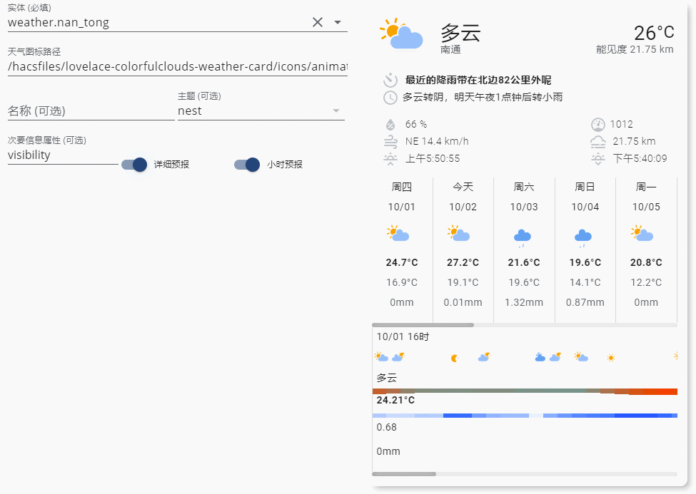

<!--
 * @Author        : fineemb
 * @Github        : https://github.com/fineemb
 * @Description   : 
 * @Date          : 2020-02-16 22:33:53
 * @LastEditors   : fineemb
 * @LastEditTime  : 2020-11-14 21:48:14
 -->

# Lovelace Colorfulclouds Weather Card

这是一个适用于[彩云天气集成](https://github.com/fineemb/Colorfulclouds-weather)的Lovelace卡片

+ 支持15天天气预报的展示
+ 支持小时详细预报
+ 支持降雨量和云量以及温度的可视化效果

## 更新

+ v1.0
  + 首次发布
  
+ v1.1
  + 修复一些路径问题
  + UI细微调整

+ v1.2

  + 合并小时预报
  + 修正气压单位问题
  + 增加前端UI配置卡片
  + 更新小时预报UI
  + 可自定义第三方的图标集
+ v1.3
  + 优化时间预报UI细节
  + 增加一套灰色图标
+ v1.3.1
  + 某些情况下消灭滚动条
  
## 预览

## 图标

### 默认

### 灰色

## HACS 安装

搜索Colorfulclouds weather card, 或者手动添加地址安装

## 配置

使用HACS安装后，可以在前端`编辑仪表盘-右下角+按钮` 添加和配置卡片
小时预报中的三个条状信息：
+ 第一条是温度，会根据这个时间段内的温差来显示不同的颜色
+ 第二条是云量，越蓝云层越多，反之越白
+ 第三条是降雨，颜色越深雨越大