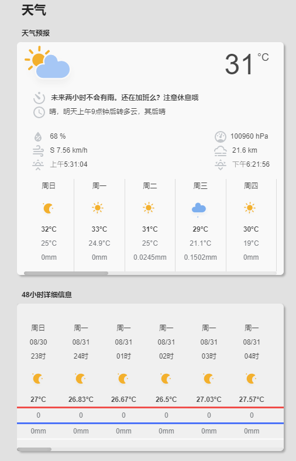

<!--
 * @Author        : fineemb
 * @Github        : https://github.com/fineemb
 * @Description   : 
 * @Date          : 2020-02-16 22:33:53
 * @LastEditors   : fineemb
 * @LastEditTime  : 2020-08-31 10:19:49
 -->

# Lovelace Colorfulclouds Weather Card

这是一个适用于[彩云天气集成](https://github.com/fineemb/Colorfulclouds-weather)的Lovelace卡片

+ 支持15天天气预报的展示
+ 支持24小时详细预报子卡片
+ 支持降雨量和云量的可视化效果

## 更新

+ v1.0

  + 首次发布

  
## 预览

## HACS 安装

搜索Colorfulclouds weather card, 或者手动添加地址安装

## 手动安装

不建议手动安装了, 配置已经支持UI前端配置, 无需书写代码